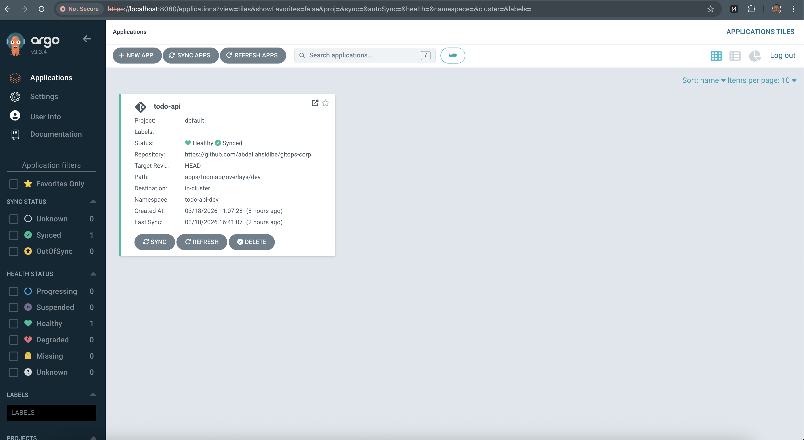
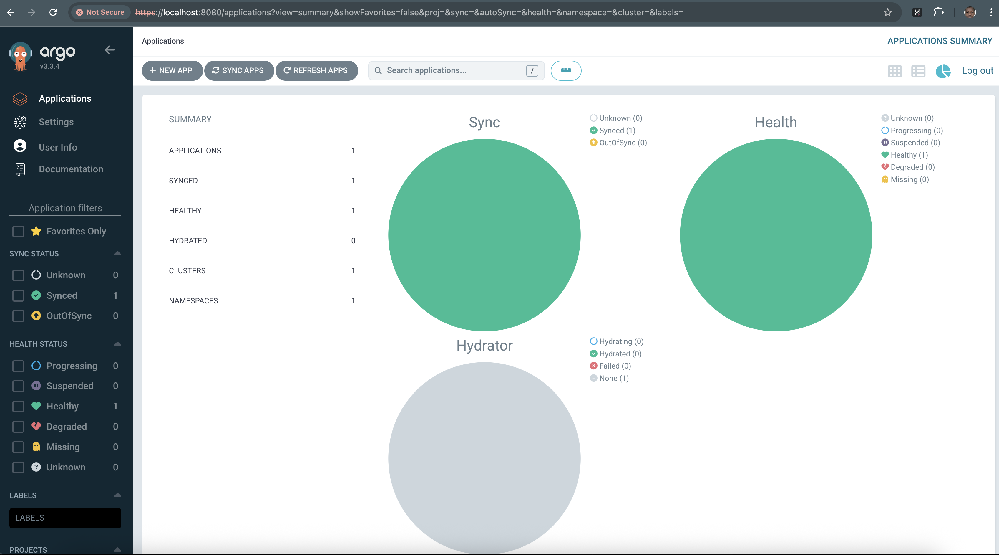
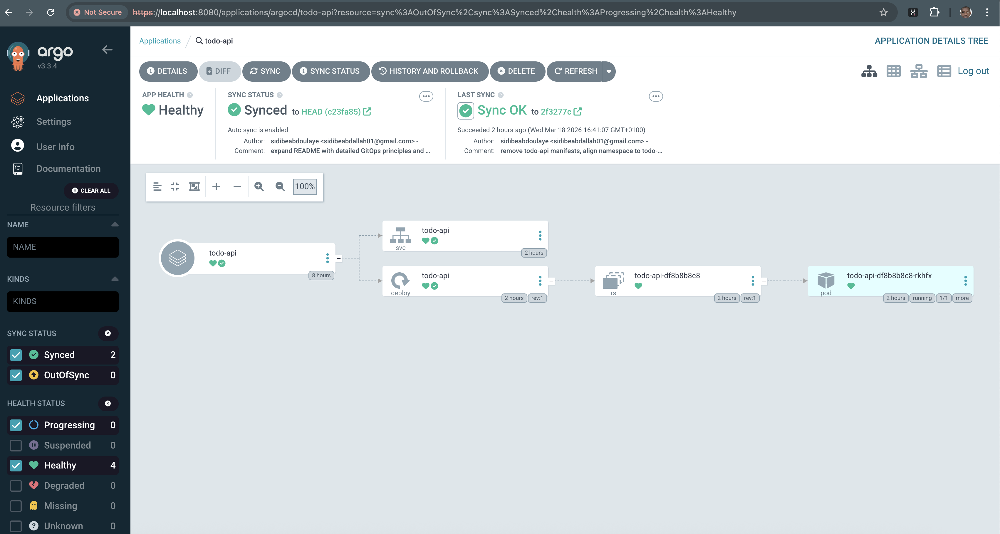
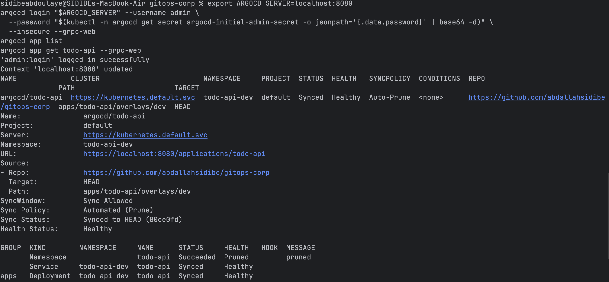
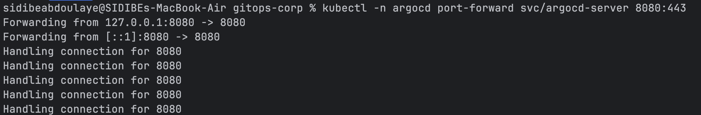
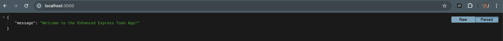
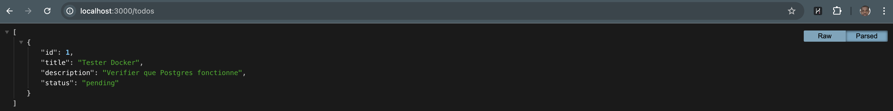

# GitOps Todo API — Déploiement avec Argo CD et Kustomize

Ce dépôt décrit le déploiement d’une API Todo basée sur l’image publique `docker.io/shatri/todo-api-node` en suivant les bonnes pratiques GitOps avec Argo CD et Kustomize (base + overlays `dev` et `staging`).

---
## Principe (GitOps)
Le GitOps repose sur une règle simple :

✅ Git est la source de vérité

❌ On ne déploie jamais directement sur le cluster

🔄 Workflow

Dev → \`git push\` → ArgoCD détecte → Sync → Kubernetes

## Prérequis
- Accès à un cluster Kubernetes et `kubectl` configuré
- Argo CD installé (namespace `argocd`)
- Optionnel: `argocd` CLI, `kustomize` CLI

## Lancer le déploiement
Pousser vos changements sur la branche suivie par Argo CD (ex: `main`).

### 1) Installer ArgoCD (si nécessaire)
```bash
    kubectl create namespace argocd
    kubectl apply -n argocd -f https://raw.githubusercontent.com/argoproj/argo-cd/stable/manifests/install.yaml
```

### 2) Déployer l’application via GitOps
Appliquez le manifest de l'Application Argo CD qui pilotera le déploiement :
```bash
    kubectl apply -f application.yaml -n argocd
```

### 3) Créer/mettre à jour l’Application Argo CD:
```bash
    kubectl apply -n argocd -f application.yaml
```
### 4) Synchroniser dans Argo CD (UI) ou en CLI:
Synchronisez manuellement (si l'auto-sync n'est pas actif) :
```bash
    argocd app sync todo-api
```
- Sans CLI Argo CD (alternative):
```bash
    kubectl -n argocd annotate application todo-api argocd.argoproj.io/refresh=hard --overwrite
```
### 5) Vérifier (namespace dev par défaut: todo-api-dev):
```bash
    kubectl get ns todo-api-dev
    kubectl -n todo-api-dev get deploy,po,svc -l app=todo-api
```
### 6) Tester depuis le cluster:
```bash
    kubectl -n todo-api-dev run tmp --rm -it --image=curlimages/curl --restart=Never -- \
      curl -sS http://todo-api.todo-api-dev.svc.cluster.local/
```

---
##  Accès aux interfaces (Port-Forward)

Pour tester l'application et l'UI Argo CD localement :

| Interface | Commande Port-Forward | URL |
| :--- | :--- | :--- |
| **Argo CD UI** | \`kubectl port-forward svc/argocd-server -n argocd 8080:443\` | [https://localhost:8080](https://localhost:8080) |
| **Todo API (Dev)** | \`kubectl port-forward svc/todo-api -n todo-api-dev 3000:80\` | [http://localhost:3000](http://localhost:3000) |

---

## Structure Kustomize
```
apps/todo-api/
├── base/
│  ├── kustomization.yaml
│  ├── deployment.yaml          # image: docker.io/shatri/todo-api-node, port 3000
│  └── service.yaml             # Service 80 -> targetPort: http (3000)
└── overlays/
   ├── dev/
   │  ├── kustomization.yaml    # namespace: todo-api-dev, labels, patch replicas
   │  ├── namespace.yaml        # Namespace todo-api-dev (optionnel si CreateNamespace=true)
   │  └── patch-replicas.yaml   # replicas: 1
   └── staging/
      ├── kustomization.yaml
      └── patch-replicas.yaml   # replicas: 2
```
Application Argo CD: `application.yaml` pointe sur `apps/todo-api/overlays/dev`.

## Détails techniques
| Paramètre | Description | Valeur par défaut |
| :--- | :--- | :--- |
| **Image** | Source de l'application | \`docker.io/shatri/todo-api-node\` |
| **Tag (Dev)** | Version déployée | \`v1\` (via Kustomize) |
| **Réplicas (Dev)** | Nombre d'instances | \`1\` |
| **Réplicas (Staging)** | Nombre d'instances | \`2\` |
| **Port Service** | Port exposé par le cluster | \`80\` |
| **Port App** | Port d'écoute du conteneur | \`3000\` |

## Important — Namespace dev (todo-api-dev)
- L’Application Argo CD du dépôt cible le namespace `todo-api-dev`:
    - Fichier: `application.yaml` → `spec.destination.namespace: todo-api-dev`
    - Option active: `syncOptions: [CreateNamespace=true]`
- Si vos manifests d’overlay `dev` définissent encore un objet `Namespace` nommé `todo-api`, alignez l’overlay pour éviter tout conflit:
    - Option A (recommandée): retirez `overlays/dev/namespace.yaml` et laissez Argo CD créer `todo-api-dev`.
    - Option B: ajoutez `namespace: todo-api-dev` dans `overlays/dev/kustomization.yaml` et gardez `CreateNamespace=true`.
- Forcer une resynchronisation sans CLI Argo CD:
```bash
    kubectl -n argocd annotate application todo-api argocd.argoproj.io/refresh=hard --overwrite
```
- Vérifier ensuite:
```bash
    kubectl get ns todo-api-dev
    kubectl -n todo-api-dev get deploy,po,svc -l app=todo-api
```

## Lancer en staging (nouvelle Application)
Deux options:
- Créer une deuxième Application Argo CD pointant sur `apps/todo-api/overlays/staging`
- Ou cloner/adapter `application.yaml` avec `path: apps/todo-api/overlays/staging`

Exemple rapide (nouvelle app):
```yaml
apiVersion: argoproj.io/v1alpha1
kind: Application
metadata:
  name: todo-api-staging
  namespace: argocd
spec:
  project: default
  source:
    repoURL: https://github.com/abdallahsidibe/gitops-corp
    targetRevision: HEAD
    path: apps/todo-api/overlays/staging
  destination:
    server: https://kubernetes.default.svc
    namespace: todo-api
  syncPolicy:
    automated:
      prune: true
      selfHeal: true
    syncOptions:
      - CreateNamespace=true
```

## Inspection locale (sans déployer)
- Générer les manifests:
```bash
    kustomize build apps/todo-api/overlays/dev | less
    kustomize build apps/todo-api/overlays/staging | less
```
- Conformément à GitOps, évitez `kubectl apply -f -` directement; validez via PR + Argo CD.

## Configuration
- Changer le nombre de réplicas: éditez `overlays/*/patch-replicas.yaml`
- Figer l’image par digest (recommandé):
```yaml
images:
- name: docker.io/shatri/todo-api-node
  newName: docker.io/shatri/todo-api-node@sha256:<digest>
```
- Variables/Secrets: utilisez `SealedSecrets` ou `External Secrets` (pas de secret en clair)
- Réseau/Scalabilité: ajoutez `NetworkPolicy` et `HPA` selon vos besoins

## Maintenance & Dépannage
- **Logs** : \`kubectl -n todo-api-dev logs deploy/todo-api\`
- **Changer les réplicas** : Modifier \`apps/todo-api/overlays/*/patch-replicas.yaml\` puis \`git push\`.
- **Secrets** : Utiliser un outil tiers comme **SealedSecrets** (Bitnami) pour chiffrer les secrets dans Git.

- App en `OutOfSync`: `argocd app sync todo-api`
- Pods en CrashLoop avec FS en lecture seule: vérifiez le montage `/tmp` et les probes
- Service non joignable: vérifiez `selector`/labels, port nommé `http`, et endpoints
- Logs:
```bash
    kubectl -n todo-api-dev logs deploy/todo-api -c todo-api --tail=200
```

## Nettoyage
- Supprimer l’application Argo CD (prune des ressources):
```bash
    argocd app delete todo-api --yes
```
- Si le namespace a été créé par Argo CD (CreateNamespace=true), il sera supprimé automatiquement s’il est géré. Sinon, supprimez-le manuellement (dev):
```bash
    kubectl delete ns todo-api-dev
```

---

## Commandes utiles
```bash
# Liste des applications ArgoCD
    argocd app list

# Détails d'une application
    argocd app get todo-api

# Forcer une synchronisation
    argocd app sync todo-api

# Voir les logs de l'app
    argocd app logs todo-api

# Lister les pods
    kubectl get pods -n todo-api

# Surveiller en temps réel
    kubectl get pods -n todo-api --watch
```

## Audit de Déploiement : De la Synchronisation GitOps au Rendu Applicatif

### État Souhaité (Objectif)
Le but est d'obtenir une application parfaitement saine et synchronisée automatiquement depuis Git.

||


*Figure 1 : Tableau de bord Argo CD confirmant que 100% des applications sont 'Healthy' et 'Synced'.*

###  1. Authentification et État Argo CD (CLI)
L'étape initiale consiste à s'authentifier auprès du serveur Argo CD pour vérifier l'état des ressources en ligne de commande. Cette capture confirme que l'application `todo-api` est synchronisée avec succès.


*Figure : Extraction des détails de l'application via `argocd app get`.*

---

###  2. Gestion du Flux Réseau (Port-Forward)
Pour accéder aux services internes du cluster depuis une machine locale, nous utilisons le tunnel de redirection de port via `kubectl`.



*Figure : Terminal illustrant les connexions actives vers le service `argocd-server`.*

---

###  3. Validation de l'API (Rendu Navigateur)

Une fois les ressources synchronisées et le tunnel établi, nous validons la disponibilité de l'application sur `localhost:3000`.

####  Message de Bienvenue (Root)
Vérification de l'endpoint principal de l'API Express.


####  Récupération des Données (/todos)
Validation de la persistance et de l'affichage des tâches provenant de la base de données.


---

##  Points clés (expert)
- ❌ **Immutabilité** : Ne jamais modifier le cluster manuellement (\`kubectl edit\`).
- ✅ **Versionnement** : Éviter le tag \`:latest\`, privilégier les tags fixes ou les digests SHA. Utiliser des versions immuables (ex: `v1.0.0`, digest SHA)
- 🔄 **Auto-healing** : Argo CD ramène le cluster vers l'état défini dans Git en cas de dérive. ArgoCD = contrôle total de l’état du cluster

---

## ✅ Résultat final
- ✔ Déploiement GitOps fonctionnel
- ✔ Sync automatique Git → Kubernetes
- ✔ Isolation par namespaces (\`dev\` / \`staging\`).
- ✔ Sécurité renforcée par défaut.
- ✔ Self-healing actif
- ✔ Scaling via Git
- ✔ Rollback disponible

---

